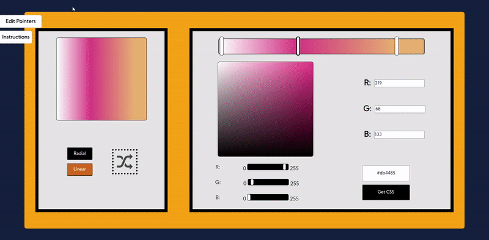
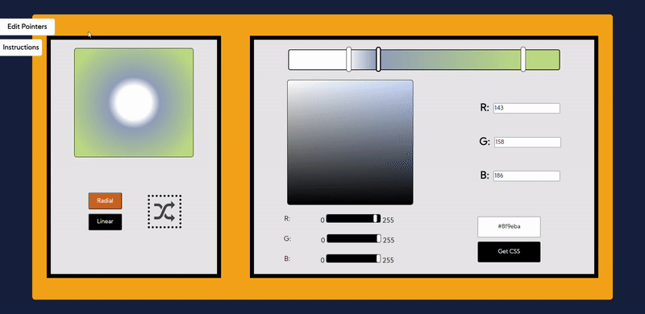

 
  

<!-- PROJECT LOGO -->

<br />

<p align="center">
  
  

</p>

 &nbsp;&nbsp;&nbsp;&nbsp;&nbsp;&nbsp;&nbsp;&nbsp;&nbsp;&nbsp;&nbsp;&nbsp;&nbsp;&nbsp;&nbsp;&nbsp;&nbsp;&nbsp;&nbsp;&nbsp;&nbsp;&nbsp;&nbsp;&nbsp;&nbsp;&nbsp;&nbsp;&nbsp;&nbsp;&nbsp;&nbsp;&nbsp;&nbsp;&nbsp;&nbsp;&nbsp;&nbsp;&nbsp;&nbsp;&nbsp;&nbsp;&nbsp;&nbsp;&nbsp;&nbsp;&nbsp;&nbsp;&nbsp;&nbsp;&nbsp;&nbsp;&nbsp;&nbsp;&nbsp;&nbsp;&nbsp;&nbsp;&nbsp;&nbsp;

[](https://opensource.org/licenses/MIT)

  <h3 align="center">CSS - Gradient Gen</h3>

  <p align="center">
     A CSS gradient generator made using HTML, CSS, JQuery
    <br />
    <a href="https://gradient-gen.herokuapp.com/">View Website</a>
  </p>


<!-- TABLE OF CONTENTS -->
<details open="open">
  <summary>Table of Contents</summary>
  <ol>
        <li><a href="#built-with">Built With</a></li>
      </ul>
    </li>
    <li><a href="#installation">Installation</a></li></li>
      </ul>
    </li>
    <li><a href="#usage">Usage</a></li>
    <li><a href="#roadmap">Roadmap</a></li>
    <li><a href="#contact">Contact</a></li>
    <li><a href="#acknowledgements">Acknowledgements</a></li>
  </ol>
</details>


<!-- ABOUT THE PROJECT -->
## About The Project


### Built With

* [JQuery](https://jquery.com)

### Installation
   ```sh
   git clone https://github.com/suryakanigolla/css-gradient-gen.git
   ```


<!-- USAGE EXAMPLES -->
## Usage

<figure>
    
    <figcaption align="center">Get code for linear and radial gradients</figcaption>
</figure>
<figure>
    
    <figcaption align="center">Editing pointers</figcaption>
</figure>


<!-- ROADMAP -->
## Roadmap

<ul>
    <li>Immersive Tutorial</li>
    <li>Gradient Recommendations</li>
</ul>


<!-- CONTACT -->
## Contact

[![LinkedIn][linkedin-shield]][linkedin-url]


<!-- ACKNOWLEDGEMENTS -->
## Acknowledgements
* [jQueryUI](https://jqueryui.com/)
* [MicroModal](https://micromodal.now.sh/)


[linkedin-shield]: https://img.shields.io/badge/-LinkedIn-black.svg?style=for-the-badge&logo=linkedin&colorB=555
[linkedin-url]: https://www.linkedin.com/in/suryakanigolla/
